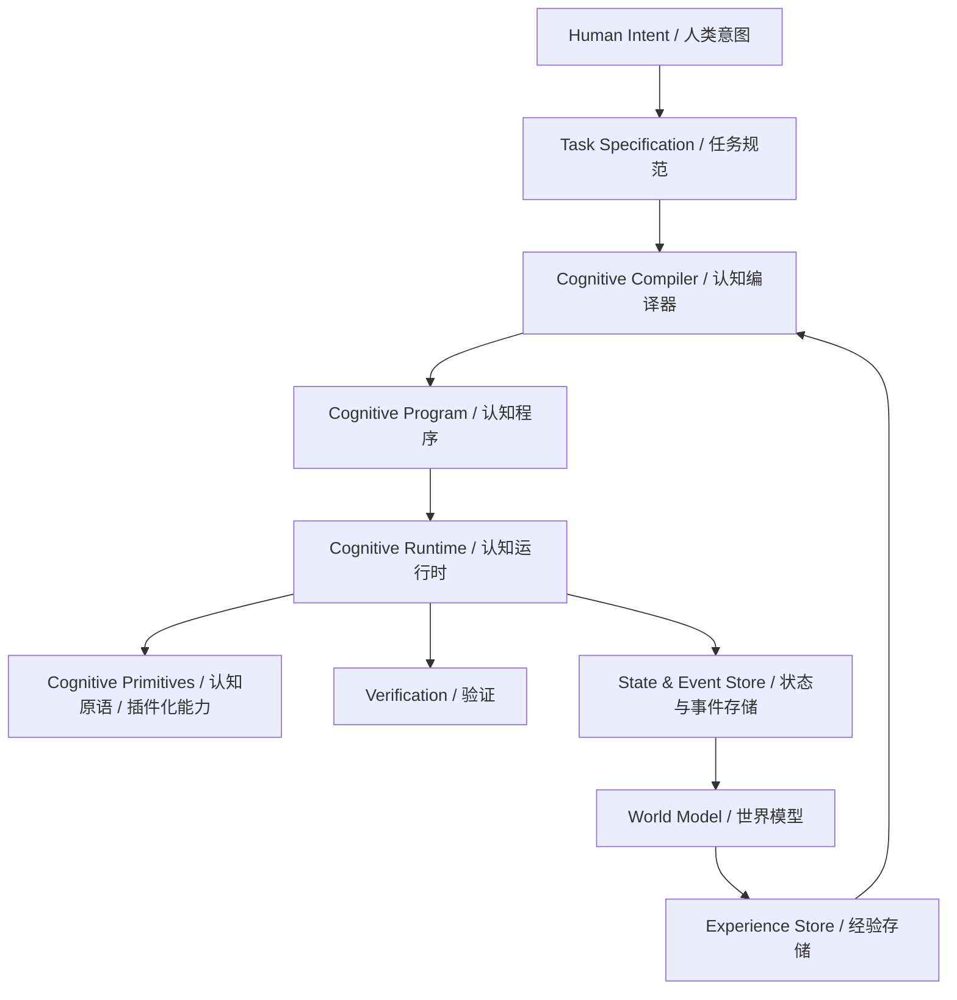

# 架构 / Architecture

## 架构论点 / Architectural thesis

ACOS 是**认知运行时加编译器（cognitive runtime plus compiler）**，不是固定 Agent 的集合。

> **注**：Cognitive Compiler 内部包含 Intent Analysis、Planner、CIR Synthesis、Validation、Optimization 等阶段（详见 [编译器设计](compiler_design.md)）。Planner 不是独立运行时实体，而是编译器的一个阶段。

## 层次 / Layers

### 1. 接口层 / Interface layer
聊天（Chat）、CLI、API、SDK。将用户输入转换为任务规范（Task Specification）。

### 2. 编译器层 / Compiler layer
任务分析、能力解析、规划、CIR 生成、图验证、优化。

### 3. 运行时层 / Runtime layer
调度（scheduling）、持久执行（durable execution）、重试（retries）、检查点（checkpoints）、效果强制执行（effect enforcement）、进程/工作器管理（process/worker management）、事件发出（event emission）。

### 4. 原语层 / Primitive layer
有类型的认知操作和提供者（providers）。

### 5. 状态层 / State layer
事件日志（event log）、物化世界状态（materialized world state）、证据（evidence）、工件（artifacts）、知识（knowledge）、经验（experience）。

### 6. 主机集成层 / Host integration layer
文件系统（filesystem）、进程（processes）、网络（network）、密钥（secrets）、浏览器/运行时适配器（browser/runtime adapters）、外部 API。

## 设计规则：Agent 作为运行时实体 / Design rule: agent as runtime entity

Agent **不是** ACOS 的一等公民。它是某个 Cognitive Program 在运行时形成的动态执行实体（run-scoped execution instance）。当运行结束时，运行时可以销毁其工作器（workers），同时保留执行记录、工件、证据和紧凑经验。

> **关键区分**：ACOS 的核心抽象是 **Cognitive Program**（编译时产物），不是 Agent（运行时实体）。这避免了 ACOS 退化为 Multi-Agent Framework。

## 设计规则：机制与策略分离 / Design rule: separate mechanism from policy

运行时拥有：

- 进程生命周期（process lifecycle）
- 持久化（persistence）
- 调度原语（scheduling primitives）
- 效果强制执行（effect enforcement）
- 通信（communication）
- 检查点（checkpoints）

模型选择（model selection）、规划器策略（planner strategy）和优化权重（optimization weights）等策略在可行时应保持在硬核之外。

## 失败域 / Failure domains

ACOS 区分：

- 原语失败（primitive failure）
- 提供者失败（provider failure）
- 编译器失败（compiler failure）
- 验证失败（validation failure）
- **补偿失败（compensation failure）**——补偿操作本身失败（如已发送的邮件无法撤回），需标记并触发人工干预
- 运行时基础设施失败（runtime infrastructure failure）
- 外部系统失败（external system failure）
- 用户策略拒绝（user-policy rejection）

每种失败类型必须有显式的恢复策略（explicit recovery strategy）。
